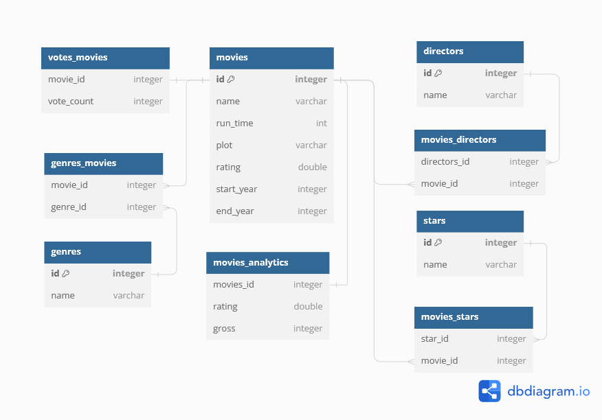

# ETL Movie
## Diagram

Caption: ERD Database structure for the movie database.


Caption: Class diagram of the database.

> For the datawarehouse I conduct star schema.

> movies table and analytics being seperated because for busienss purpose both have different purpose. While movies contains data that will be shown to users, movies analytics will contains data for business teams.

> votes column is seperated from main movies table, because vote is often changed, so the write cost cheaper if we only read-write on votes_movies whenever the vote changed.

> From the analysis, shown that Series will have two year types: start and end, meanwhile films will only have one released year which located in end_year column. Thus, I made a view that only contains films, which have null on start_year.

> On going series will have null on end_year.

## Tech Stack
In this problem, I use docker as container so it can be run on any system. To make ETL program, I use python as known for the capability to handle data. I use posgres for the DBMS because it functionality and capability not only for DDL and DML, but also its capability to analyze query, which help me measure the query cost. It used to find the most optimum query for answer.sql.

## SQL Query
To help the data query, I made two view:
- movie_gross
    <br />contains data for business analytics
    ```
    create view movie_gross (id, name, rating, start_year, end_year, gross) as 
    select
    m.id,
        name,
        rating,
        start_year,
        end_year,
    gross
    from movies m 
    join movies_analytics ma on ma.movie_id = m.id
    where gross is not null;
    ```
- film
    <br /> Contains only movie data, excluding series (start_year == Null)
    ```
    create view film (id, name, rating, release_year) as
    select
        m.id,
        name,
        rating,
        end_year
        from movies m
        where start_year is null;
    ```

Below the answer of question from the documents.
```
-- 1. Number of unique film titles
select count(distinct name) from movies where start_year is null;

-- 2. Film Title, Year of Release, and Rating of the film starring Lena Headey Sort By Yearof Release.
select 
    m.name as "Film Title",
    release_year as "Year of Release",
    rating as "Rating"
from film m
join movies_stars on m.id = movies_stars.movie_id
join stars on stars.id = movies_stars.star_id
where stars.name = 'Lena Headey'
order by release_year

-- 3. The name of the director and total gross of the films that have been directed.
select 
    d.name as "Director",
    concat('$',coalesce(sum(gross), 0),'M') as "Total Gross"
from movie_gross m
join movies_directors on m.id = movies_directors.movie_id
join directors d on d.id = movies_directors.director_id
where start_year is null 
group by 1

-- 4. Film Title, Year of Release, and Rating of 5 films that have comedy genre with the largest gross
select  
    m.name as "Film Title",
    release_year as "Year of Release",
    rating as "Rating"
from film m
join movies_genres on m.id = movies_genres.movie_id
join genres on genres.id = movies_genres.genre_id
join movies_analytics on m.id = movies_analytics.movie_id
where genres.name = 'Comedy' and gross is not null
order by gross desc
limit 5

-- 5. Film Title, Year of Release and Rating of the film directed by Martin Scorsese and starring Robert De Niro
select
    m.name as "Film Title",
    release_year as "Year of Release",
    rating as "Rating"
from film m
join movies_directors on m.id = movies_directors.movie_id
join directors d on d.id = movies_directors.director_id
join movies_stars on m.id = movies_stars.movie_id
join stars on stars.id = movies_stars.star_id
where d.name = 'Martin Scorsese' and stars.name = 'Robert De Niro'
```
Caption: also available in [`answer.sql`](answer.sql)

## How to run
### Requirements:
- docker

### Step by Step:
You will need two terminal opened to run this program.
#### First terminal
- move to `\data` directory
```
cd data
```
- run the db docker
```
docker-compose build
docker-compose up
```
- if you want to restart the DB, you should remove the container before re-run the docker

#### Second terminal
- run docker
```
docker-compose build
docker-compose up
```

## Credit
This program is belongs to Muhammad Risqi Firdaus
- [Personal Website](mrfirdauss.vercel.app)
- [Medium](https://mrfirdauss.medium.com/)
- [Github](https://github.com/mrfirdauss-20/)
- [Email](mailto:risqi.firdaus20@gmail.com)

